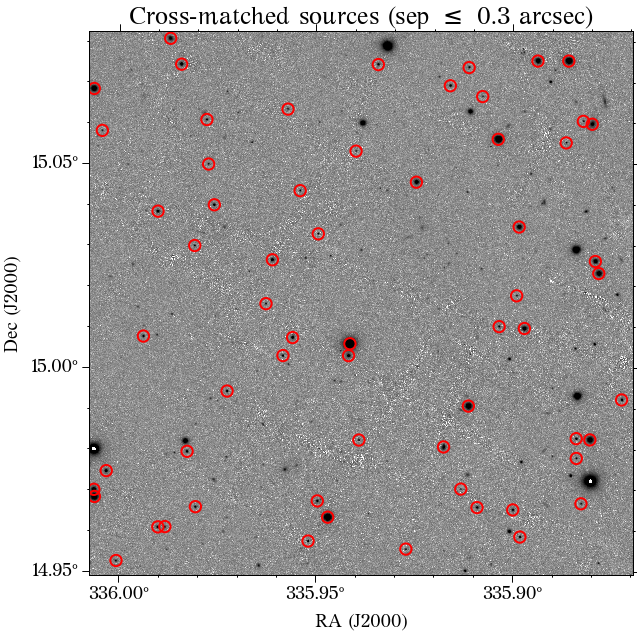
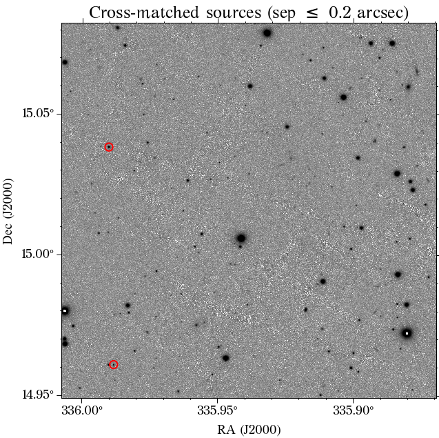

# Check WCS

Checks if the WCS (astrometry) of an image is correct.

___
## Usage Example

The code is simple to use:

```python
from check_wcs import check_wcs

ra, dec = 335.9384751, +15.0158580 
file = 'example/test_PS1_r.fits'
check_wcs(file, ra, dec, plot=True, sep_threshold=0.3)
```


If the astrometry does not look corrected, according to the precision wanted by the user, a warning message will be shown:

```python
check_wcs(file, ra, dec, plot=True, sep_threshold=0.2)
```
```
~/check_wcs.py:165: UserWarning: Less than 5 sources (2) were found with a separation of 0.2 arcsec or less
```

